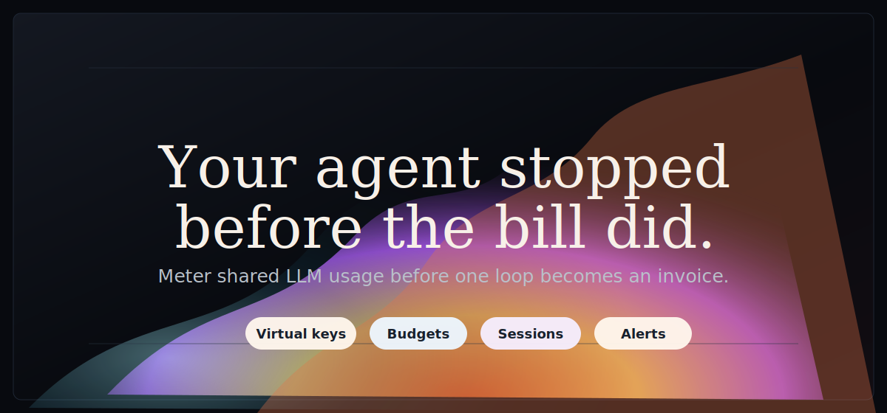
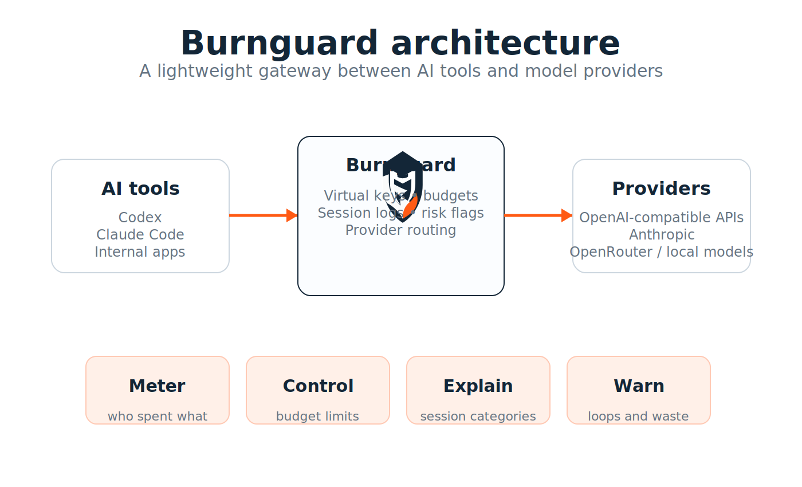
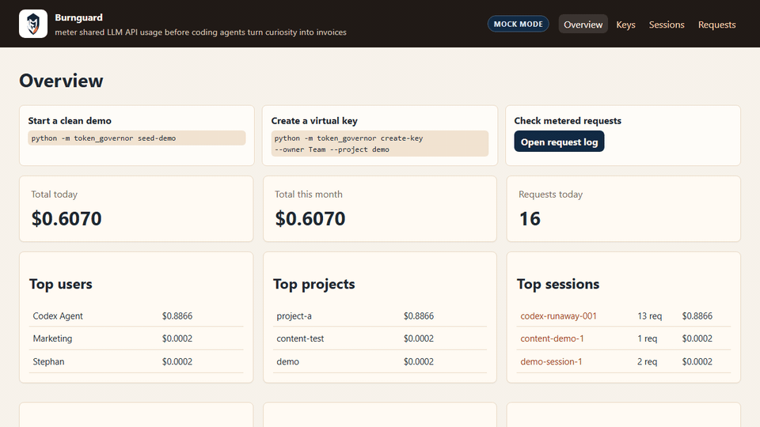

# Burnguard

[](https://github.com/Itshimcules/Burnguard/actions/workflows/tests.yml)
[](pyproject.toml)
[](LICENSE)



**Meter shared LLM API usage before coding agents turn curiosity into invoices.**

Coding agents are useful until one loops against a shared provider key and the bill only says "API usage." Burnguard gives teams a local gateway that shows which key, project, model, session, and request pattern drove the spend.

Point Hermes Agent, OpenClaw, or any OpenAI-compatible client at Burnguard. It issues virtual keys, checks budgets before forwarding, records request/session cost, and flags risky behavior like repeated prompts, large context, expensive models, and possible agent loops.

The public project name is Burnguard. The internal Python package, CLI module, environment-variable prefix, and compatibility headers still use the original `token_governor` namespace while the MVP stabilizes.

> **Working prototype:** Burnguard is intentionally small and local-first. Treat it as an MVP for exploration, demos, and feedback rather than production infrastructure. See [Security Policy](SECURITY.md) before using it with sensitive data or shared keys.

Local demo data includes 3 virtual keys, 16 metered requests, a runaway session, and a blocked request.

Built with FastAPI, SQLite, Jinja, OpenAI-compatible routing, Anthropic Messages routing, Docker, Prometheus-style metrics, Slack/Discord webhooks, CSV/JSON exports, and a plain local dashboard.

## What is this

Burnguard is a local AI API gateway for teams experimenting with coding agents and shared model accounts. Instead of handing every tool the real provider key, you hand it a Burnguard virtual key:



You get a practical control plane before the provider invoice arrives:

| Feature | Why it matters |
| --- | --- |
| Virtual API keys | Give each user, project, or agent its own local key. |
| Budget checks | Block requests that exceed daily, monthly, or max-request limits. |
| Session tracking | Group spend by agent run with `X-Token-Governor-Session`. |
| Risk flags | Surface repeated prompts, possible loops, large context, expensive models, high-cost requests, and test failure loops. |
| Local dashboard | Inspect keys, sessions, requests, model usage, categories, flags, and timelines. |
| Mock mode | Demo the full flow without spending money on a real provider. |
| Proxy mode | Forward approved requests to OpenAI-compatible or Anthropic-compatible upstreams. |
| Exports and metrics | Pull CSV/JSON reports and Prometheus-style metrics for lightweight ops workflows. |

## Quick start

Start Burnguard before asking an agent to configure itself. Mock mode is enabled by default, so the demo records usage without calling a paid provider.

```bash
python -m venv .venv
source .venv/bin/activate
pip install -e ".[dev]"
cp .env.example .env
python -m token_governor seed-demo
uvicorn token_governor.main:app --reload
```

Open the dashboard:

```text
http://localhost:8000/
```

Send one metered request:

```bash
curl http://localhost:8000/v1/chat/completions \
  -H "Authorization: Bearer tg_sk_demo" \
  -H "Content-Type: application/json" \
  -H "X-Token-Governor-Session: demo-session-1" \
  -d '{
    "model": "gpt-4o-mini",
    "messages": [
      {"role": "user", "content": "Write a Python function that adds two numbers."}
    ]
  }'
```

Then check `http://localhost:8000/requests`.

## Hermes Agent with a spending brake

Hermes Agent can keep its usual workflow while Burnguard sits in front of the model endpoint, meters each request, and shows which run is driving spend. Start Burnguard, then paste this prompt into Hermes Agent:

```terminal
$ uvicorn token_governor.main:app --reload
Burnguard running at http://localhost:8000

$ paste into Hermes Agent
Configure Hermes Agent to send OpenAI-compatible model requests through Burnguard.

Use:
- API base URL: http://localhost:8000/v1
- API key: tg_sk_demo
- Default model: gpt-4o-mini

Set Hermes to use its custom OpenAI-compatible endpoint or provider option. Keep the current model if it is already allowed by the Burnguard virtual key; otherwise use gpt-4o-mini. Do not store the real upstream provider key in Hermes. If Hermes supports custom headers, add X-Token-Governor-Session with a stable value for this project run. Keep streaming disabled for now.

After the change, send one small non-streaming chat request, confirm Burnguard records it at http://localhost:8000/requests, and report the final base URL, model, session header status, and smoke-test result.
```

Manual setup details: [Hermes Agent integration](docs/agent-integrations.md#hermes-agent).

## OpenClaw with cost visibility

OpenClaw can route through Burnguard the same way it would use any OpenAI-compatible gateway. The result is a local audit trail before long coding sessions become surprise provider bills. Start Burnguard, then paste this prompt into OpenClaw:

```terminal
$ uvicorn token_governor.main:app --reload
Burnguard running at http://localhost:8000

$ paste into OpenClaw
Configure OpenClaw to send OpenAI-compatible model requests through Burnguard.

Use:
- API base URL: http://localhost:8000/v1
- API key: tg_sk_demo
- Default model: gpt-4o-mini

Use OpenClaw's custom or OpenAI-compatible API provider path, not a Codex/OAuth subscription runtime path. Keep the current model if it is already allowed by the Burnguard virtual key; otherwise use gpt-4o-mini. Do not store the real upstream provider key in OpenClaw. If OpenClaw supports custom headers, add X-Token-Governor-Session with a stable value for this project run. Keep streaming disabled for now.

After the change, send one small non-streaming chat or responses request, confirm Burnguard records it at http://localhost:8000/requests, and report the final base URL, model, session header status, and smoke-test result.
```

Manual setup details: [OpenClaw integration](docs/agent-integrations.md#openclaw).

## Why this exists

Coding agents are useful, but they can burn tokens in loops. Shared API accounts make the problem harder because a single provider key often hides which person, project, tool, or session caused the spend.

Burnguard sits between clients and an OpenAI-compatible provider:

```text
Client / Script / Coding Agent
        |
        v
Burnguard Gateway
        |
        v
Provider API
```

It gives teams a local MVP for visibility, simple budgets, and session-level inspection without building an enterprise platform.

## What the MVP does

- Accepts OpenAI-compatible `POST /v1/chat/completions` and `POST /v1/responses` requests, plus basic Anthropic-compatible `POST /v1/messages` requests.
- Validates local virtual API keys such as `tg_sk_demo`.
- Enforces daily, monthly, and max-single-request budgets before a request is forwarded.
- Rejects unsupported streaming requests explicitly for Chat Completions, Responses, and Anthropic Messages requests.
- Runs in **mock mode** by default so demos do not spend real API money.
- Can forward to one OpenAI-compatible provider and one Anthropic Messages provider when configured.
- Logs usage metadata to SQLite: owner, project, key, model, session, tokens, cost, status, route, latency, user-agent, category, and warning flags.
- Tracks sessions using `X-Token-Governor-Session` or generates a session id automatically.
- Classifies requests with local heuristics only. No extra LLM is used.
- Detects basic risk flags: repeated prompts, possible loops, large context, expensive models, budget-near-limit, high-cost requests, and test failure loops.
- Shows a plain FastAPI/Jinja dashboard at `/`, `/keys`, `/sessions`, `/sessions/{session_id}`, and `/requests`.
- Provides `python -m token_governor seed-demo` for fake data that makes the dashboard useful immediately.
- Includes setup guidance for routing Hermes Agent, OpenClaw, and other OpenAI-compatible agents through Burnguard.

## What it does not do

This is an MVP/prototype. It does **not** provide:

- multi-user login
- SaaS billing
- Kubernetes deployment
- full enterprise RBAC
- complex frontend
- LLM-powered classification
- raw prompt storage by default
- production-grade security claims
- perfect token accounting
- perfect support for every provider
- streaming support

## Demo API request

Mock mode is enabled by default in `.env.example`, so this does not call a paid provider:

```bash
curl http://localhost:8000/v1/chat/completions \
  -H "Authorization: Bearer tg_sk_demo" \
  -H "Content-Type: application/json" \
  -H "X-Token-Governor-Session: demo-session-1" \
  -d '{
    "model": "gpt-4o-mini",
    "messages": [
      {"role": "user", "content": "Write a Python function that adds two numbers."}
    ]
  }'
```

The gateway returns an OpenAI-compatible response and records the request.

## Demo Responses API request

Burnguard also accepts basic non-streaming OpenAI Responses API requests:

```bash
curl http://localhost:8000/v1/responses \
  -H "Authorization: Bearer tg_sk_demo" \
  -H "Content-Type: application/json" \
  -H "X-Token-Governor-Session: demo-responses-session-1" \
  -d '{
    "model": "gpt-4o-mini",
    "input": "Write a Python function that adds two numbers.",
    "max_output_tokens": 128
  }'
```

The gateway returns an OpenAI Responses-shaped response in mock mode and records the request with the same budget and session controls as Chat Completions. Streaming Responses requests are rejected in this MVP.

## Demo Anthropic Messages request

Burnguard also accepts basic non-streaming Anthropic Messages API requests. The local virtual key can be passed with Anthropic-style `x-api-key` or as an Authorization bearer token:

```bash
curl http://localhost:8000/v1/messages \
  -H "x-api-key: tg_sk_demo" \
  -H "Content-Type: application/json" \
  -H "X-Token-Governor-Session: demo-anthropic-session-1" \
  -d '{
    "model": "claude-sonnet",
    "max_tokens": 128,
    "messages": [
      {"role": "user", "content": "Write a Python function that adds two numbers."}
    ]
  }'
```

In mock mode, the gateway returns an Anthropic Messages-shaped response and records the request with the same budget, privacy, warning flag, and session controls as the OpenAI-compatible routes. Streaming Messages requests are rejected in this MVP.

## Create a virtual key

```bash
python -m token_governor create-key \
  --owner "alex" \
  --project "demo" \
  --daily-budget 5 \
  --monthly-budget 100 \
  --max-request 1
```

You can also provide `--key tg_sk_my_key`, `--allowed-models gpt-4o-mini,gpt-4.1,claude-sonnet`, and `--provider anthropic` for keys intended for Anthropic Messages routes.

## Budget behavior

Burnguard uses HTTP **402 Payment Required** when a request is blocked by policy.

Example response:

```json
{
  "error": {
    "message": "Request blocked by Burnguard budget policy.",
    "type": "budget_exceeded",
    "details": {
      "daily_budget_usd": 5.0,
      "daily_spend_usd": 4.99,
      "projected_daily_spend_usd": 7.99,
      "estimated_request_cost_usd": 3.0
    }
  }
}
```

Budgets are intentionally simple:

- `daily_budget_usd`
- `monthly_budget_usd`
- `max_single_request_usd`

Before forwarding a request, Burnguard estimates input and expected output cost and blocks requests that would push the key over its daily or monthly budget. After a provider response, it records final estimated cost from returned usage when available.

## Pricing notes

Model pricing lives in `token_governor/pricing.py`. Defaults are placeholders for demo purposes and must be verified before real use.

Included sample entries:

```json
{
  "gpt-4o-mini": {"input_per_1m": 0.15, "output_per_1m": 0.60},
  "gpt-4.1": {"input_per_1m": 2.00, "output_per_1m": 8.00},
  "claude-sonnet": {"input_per_1m": 3.00, "output_per_1m": 15.00}
}
```

## Privacy and security notes

See [Security Policy](SECURITY.md) for the current prototype security model, key-handling guidance, and recommended hardening work before any production-style deployment.

By default, Burnguard does **not** store full prompts or full responses.

It stores:

- prompt hash
- response hash
- short redacted previews capped at 200 characters
- category labels
- usage metadata

Raw message storage is controlled by:

```env
STORE_RAW_MESSAGES=false
```

If this is false, raw prompt and response bodies are not persisted. Previews are still only lightweight heuristics: common API keys, bearer tokens, passwords, secrets, and email addresses are redacted, but teams should treat previews as operational metadata rather than a security boundary.

## Configuration

Copy `.env.example` to `.env` and edit as needed:

```env
TOKEN_GOVERNOR_MODE=mock
DATABASE_URL=sqlite:///./token_governor.db
OPENAI_COMPATIBLE_BASE_URL=https://api.openai.com/v1
OPENAI_COMPATIBLE_API_KEY=replace_me
ANTHROPIC_BASE_URL=https://api.anthropic.com/v1
ANTHROPIC_API_KEY=replace_me
ANTHROPIC_VERSION=2023-06-01
STORE_RAW_MESSAGES=false
DEFAULT_DAILY_BUDGET_USD=5
DEFAULT_MONTHLY_BUDGET_USD=100
DEFAULT_MAX_SINGLE_REQUEST_USD=1
LARGE_CONTEXT_TOKEN_THRESHOLD=50000
LOOP_REQUEST_COUNT=10
LOOP_WINDOW_MINUTES=15
SLACK_WEBHOOK_URL=
DISCORD_WEBHOOK_URL=
```

To call real providers, set the matching upstream credentials for the route you expose:

```env
TOKEN_GOVERNOR_MODE=proxy
OPENAI_COMPATIBLE_BASE_URL=https://api.openai.com/v1
OPENAI_COMPATIBLE_API_KEY=your_real_openai_compatible_key
ANTHROPIC_BASE_URL=https://api.anthropic.com/v1
ANTHROPIC_API_KEY=your_real_anthropic_key
ANTHROPIC_VERSION=2023-06-01
```

For LiteLLM, point Burnguard at the LiteLLM OpenAI-compatible proxy:

```env
TOKEN_GOVERNOR_MODE=proxy
OPENAI_COMPATIBLE_BASE_URL=http://localhost:4000/v1
OPENAI_COMPATIBLE_API_KEY=your_litellm_proxy_key
```

Optional Slack and Discord webhook URLs send alerts for blocked requests by default. Set `ALERT_ON_WARNING_FLAGS=true` to also alert when Burnguard records warning flags.

## Deployment

Run locally with Docker Compose:

```bash
cp .env.example .env
docker compose up --build
```

Burnguard listens on `http://localhost:8000/` and stores SQLite data in the `burnguard-data` volume.

## Dashboard pages



- `/` — overview: spend, requests, top users/projects/sessions/models, categories, flags, blocked requests
- `/keys` — virtual keys and budgets
- `/sessions` — session list with spend totals
- `/sessions/{session_id}` — session detail, repeated prompts, category breakdown, flags, timeline
- `/requests` — recent request log
- `/reports/pull-requests` — JSON spend report grouped by GitHub PR correlation headers
- `/exports/usage.json` and `/exports/usage.csv` — usage export endpoints
- `/metrics` — Prometheus-style text metrics

## Development

```bash
pytest
python -m token_governor seed-demo
uvicorn token_governor.main:app --reload
```

## Roadmap

Shipped:

- OpenAI Responses API: basic non-streaming `POST /v1/responses` with tool metadata extraction for metering.
- Anthropic Messages API: basic non-streaming `POST /v1/messages` with tool-use metadata extraction for metering.
- Hermes Agent and OpenClaw gateway setup, documented for OpenAI-compatible routing.
- LiteLLM integration through the OpenAI-compatible proxy base URL.
- Slack/Discord webhook alerts for blocked requests and optional warning flags.
- GitHub PR/session correlation via `X-Token-Governor-GitHub-Repo` and `X-Token-Governor-GitHub-PR` request headers.
- MCP/tool-call cost attribution: tool names and tool-call counts are recorded when present in request or response payloads.
- Repeated file/context detection: repeated file-context fingerprints can raise `repeated_context`.
- Cost-per-PR reports: `/reports/pull-requests` groups spend by PR correlation headers.
- Docker Compose deployment: `docker compose up --build`.
- CSV/JSON exports at `/exports/usage.csv` and `/exports/usage.json`.
- Prometheus-style metrics at `/metrics`.

Planned:

- streaming support
- per-team approval workflows
- hosted dashboard mode
- OpenTelemetry support

## License

MIT
