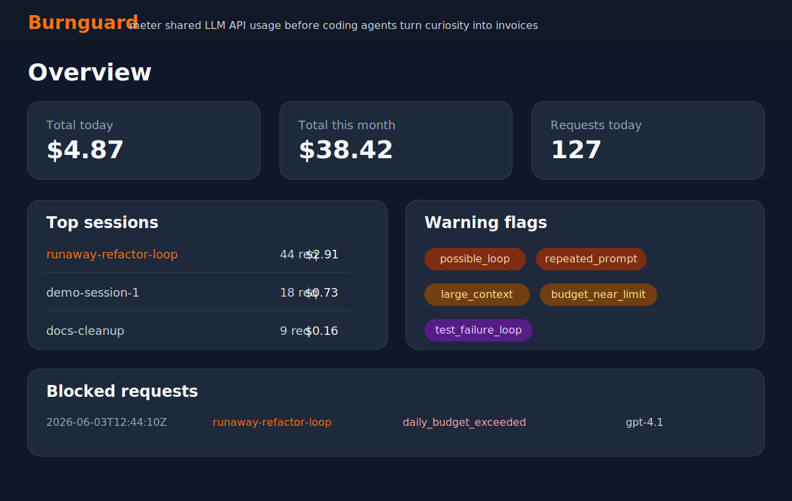

# Burnguard

[](https://github.com/Itshimcules/Burnguard/actions/workflows/tests.yml)
[](pyproject.toml)
[](LICENSE)

**Guardrails for shared LLM API usage.**

Burnguard is a small open-source prototype for metering shared AI API usage before coding agents turn curiosity into invoices.

It sits between AI tools and model providers, issuing local virtual keys, enforcing simple budgets, logging session-level usage, and flagging patterns like repeated prompts, large context, expensive model use, and possible agent loops.

In a better tooling world, providers and coding agents would make per-user budgets, session-level cost visibility, and runaway-loop protection native. Until then, teams need a practical way to see who spent what, why it was spent, and when a session should have stopped.

> **Design phase / working prototype:** Burnguard is intentionally small and local-first. Treat the current implementation as an MVP for exploration, demos, and feedback rather than production infrastructure.



## 5-minute demo

Start Burnguard before asking an agent to configure itself. Mock mode is enabled by default, so the demo records usage without calling a paid provider.

```bash
python -m venv .venv
source .venv/bin/activate
pip install -e .[dev]
cp .env.example .env
python -m token_governor seed-demo
uvicorn token_governor.main:app --reload
```

Open the dashboard:

```text
http://localhost:8000/
```

Send one metered request:

```bash
curl http://localhost:8000/v1/chat/completions \
  -H "Authorization: Bearer tg_sk_demo" \
  -H "Content-Type: application/json" \
  -H "X-Token-Governor-Session: demo-session-1" \
  -d '{
    "model": "gpt-4o-mini",
    "messages": [
      {"role": "user", "content": "Write a Python function that adds two numbers."}
    ]
  }'
```

Then check `http://localhost:8000/requests`.

## Use with Hermes Agent

After Burnguard is running, paste this into Hermes Agent to have it route model calls through the local gateway:

```text
Configure Hermes Agent to route OpenAI-compatible model requests through Burnguard.

Use these Burnguard settings:
- API base URL: http://localhost:8000/v1
- API key: tg_sk_demo
- Default model: gpt-4o-mini

Requirements:
1. Inspect the existing Hermes model/provider configuration before changing anything.
2. Use Hermes' custom OpenAI-compatible endpoint/provider option.
3. Preserve the current model name if one is already configured and it is allowed by the Burnguard virtual key; otherwise use gpt-4o-mini.
4. Do not put the real upstream OpenAI, Anthropic, OpenRouter, or other provider key into Hermes. Burnguard proxy mode should own real upstream provider keys.
5. If Hermes supports custom headers in this setup, add X-Token-Governor-Session with a stable value for this project or agent run.
6. Keep streaming disabled unless Burnguard has explicit streaming support.
7. After configuration, run one small non-streaming chat request and confirm Burnguard records it on http://localhost:8000/requests.

Report the files or settings changed, the final base URL, the model, whether a session header was configured, and the result of the smoke test.
```

For manual Hermes setup details, see [docs/agent-integrations.md](docs/agent-integrations.md#hermes-agent).

## Use with OpenClaw

After Burnguard is running, paste this into OpenClaw to have it route model calls through the local gateway:

```text
Configure OpenClaw to route OpenAI-compatible model requests through Burnguard.

Use these Burnguard settings:
- API base URL: http://localhost:8000/v1
- API key: tg_sk_demo
- Default model: gpt-4o-mini

Requirements:
1. Inspect the existing OpenClaw model/provider/runtime configuration before changing anything.
2. Use OpenClaw's custom or OpenAI-compatible API provider path, not a Codex/OAuth subscription runtime path.
3. Preserve the current model name if one is already configured and it is allowed by the Burnguard virtual key; otherwise use gpt-4o-mini.
4. Do not put the real upstream OpenAI, Anthropic, OpenRouter, or other provider key into OpenClaw. Burnguard proxy mode should own real upstream provider keys.
5. If OpenClaw supports custom headers in this setup, add X-Token-Governor-Session with a stable value for this project or agent run.
6. Keep streaming disabled unless Burnguard has explicit streaming support.
7. After configuration, run one small non-streaming chat or responses request and confirm Burnguard records it on http://localhost:8000/requests.

Report the files or settings changed, the final base URL, the model, whether a session header was configured, and the result of the smoke test.
```

For manual OpenClaw setup details, see [docs/agent-integrations.md](docs/agent-integrations.md#openclaw).

## Why this exists

Coding agents are useful, but they can burn tokens in loops. Shared API accounts make the problem harder because a single provider key often hides which person, project, tool, or session caused the spend.

Burnguard sits between clients and an OpenAI-compatible provider:

```text
Client / Script / Coding Agent
        ↓
Burnguard Gateway
        ↓
Provider API
```

It gives teams a local MVP for visibility, simple budgets, and session-level inspection without building an enterprise platform.

## What the MVP does

- Accepts OpenAI-compatible `POST /v1/chat/completions` and `POST /v1/responses` requests, plus basic Anthropic-compatible `POST /v1/messages` requests.
- Validates local virtual API keys such as `tg_sk_demo`.
- Enforces daily, monthly, and max-single-request budgets before a request is forwarded.
- Rejects unsupported streaming requests explicitly for Chat Completions, Responses, and Anthropic Messages requests.
- Runs in **mock mode** by default so demos do not spend real API money.
- Can forward to one OpenAI-compatible provider and one Anthropic Messages provider when configured.
- Logs usage metadata to SQLite: owner, project, key, model, session, tokens, cost, status, route, latency, user-agent, category, and warning flags.
- Tracks sessions using `X-Token-Governor-Session` or generates a session id automatically.
- Classifies requests with local heuristics only. No extra LLM is used.
- Detects basic risk flags: repeated prompts, possible loops, large context, expensive models, budget-near-limit, high-cost requests, and test failure loops.
- Shows a plain FastAPI/Jinja dashboard at `/`, `/keys`, `/sessions`, `/sessions/{session_id}`, and `/requests`.
- Provides `python -m token_governor seed-demo` for fake data that makes the dashboard useful immediately.
- Includes setup guidance for routing Hermes Agent, OpenClaw, and other OpenAI-compatible agents through Burnguard.

## What it does not do

This is an MVP/prototype. It does **not** provide:

- multi-user login
- SaaS billing
- Kubernetes deployment
- full enterprise RBAC
- complex frontend
- LLM-powered classification
- raw prompt storage by default
- production-grade security claims
- perfect token accounting
- perfect support for every provider
- streaming support

## Quick start

```bash
python -m venv .venv
source .venv/bin/activate
pip install -e .[dev]
cp .env.example .env
python -m token_governor seed-demo
uvicorn token_governor.main:app --reload
```

Open the dashboard:

```text
http://localhost:8000/
```

## Demo API request

Mock mode is enabled by default in `.env.example`, so this does not call a paid provider:

```bash
curl http://localhost:8000/v1/chat/completions \
  -H "Authorization: Bearer tg_sk_demo" \
  -H "Content-Type: application/json" \
  -H "X-Token-Governor-Session: demo-session-1" \
  -d '{
    "model": "gpt-4o-mini",
    "messages": [
      {"role": "user", "content": "Write a Python function that adds two numbers."}
    ]
  }'
```

The gateway returns an OpenAI-compatible response and records the request.

## Demo Responses API request

Burnguard also accepts basic non-streaming OpenAI Responses API requests:

```bash
curl http://localhost:8000/v1/responses \
  -H "Authorization: Bearer tg_sk_demo" \
  -H "Content-Type: application/json" \
  -H "X-Token-Governor-Session: demo-responses-session-1" \
  -d '{
    "model": "gpt-4o-mini",
    "input": "Write a Python function that adds two numbers.",
    "max_output_tokens": 128
  }'
```

The gateway returns an OpenAI Responses-shaped response in mock mode and records the request with the same budget and session controls as Chat Completions. Streaming Responses requests are rejected in this MVP.

## Demo Anthropic Messages request

Burnguard also accepts basic non-streaming Anthropic Messages API requests. The local virtual key can be passed with Anthropic-style `x-api-key` or as an Authorization bearer token:

```bash
curl http://localhost:8000/v1/messages \
  -H "x-api-key: tg_sk_demo" \
  -H "Content-Type: application/json" \
  -H "X-Token-Governor-Session: demo-anthropic-session-1" \
  -d '{
    "model": "claude-sonnet",
    "max_tokens": 128,
    "messages": [
      {"role": "user", "content": "Write a Python function that adds two numbers."}
    ]
  }'
```

In mock mode, the gateway returns an Anthropic Messages-shaped response and records the request with the same budget, privacy, warning flag, and session controls as the OpenAI-compatible routes. Streaming Messages requests are rejected in this MVP.

## Create a virtual key

```bash
python -m token_governor create-key \
  --owner "Stephan" \
  --project "demo" \
  --daily-budget 5 \
  --monthly-budget 100 \
  --max-request 1
```

You can also provide `--key tg_sk_my_key`, `--allowed-models gpt-4o-mini,gpt-4.1,claude-sonnet`, and `--provider anthropic` for keys intended for Anthropic Messages routes.

## Budget behavior

Burnguard uses HTTP **402 Payment Required** when a request is blocked by policy.

Example response:

```json
{
  "error": {
    "message": "Request blocked by Burnguard budget policy.",
    "type": "budget_exceeded",
    "details": {
      "daily_budget_usd": 5.0,
      "daily_spend_usd": 4.99,
      "projected_daily_spend_usd": 7.99,
      "estimated_request_cost_usd": 3.0
    }
  }
}
```

Budgets are intentionally simple:

- `daily_budget_usd`
- `monthly_budget_usd`
- `max_single_request_usd`

Before forwarding a request, Burnguard estimates input and expected output cost and blocks requests that would push the key over its daily or monthly budget. After a provider response, it records final estimated cost from returned usage when available.

## Pricing notes

Model pricing lives in `token_governor/pricing.py`. Defaults are placeholders for demo purposes and must be verified before real use.

Included sample entries:

```json
{
  "gpt-4o-mini": {"input_per_1m": 0.15, "output_per_1m": 0.60},
  "gpt-4.1": {"input_per_1m": 2.00, "output_per_1m": 8.00},
  "claude-sonnet": {"input_per_1m": 3.00, "output_per_1m": 15.00}
}
```

## Privacy notes

By default, Burnguard does **not** store full prompts or full responses.

It stores:

- prompt hash
- response hash
- short redacted previews capped at 200 characters
- category labels
- usage metadata

Raw message storage is controlled by:

```env
STORE_RAW_MESSAGES=false
```

If this is false, raw prompt and response bodies are not persisted. Previews are still only lightweight heuristics: common API keys, bearer tokens, passwords, secrets, and email addresses are redacted, but teams should treat previews as operational metadata rather than a security boundary.

## Configuration

Copy `.env.example` to `.env` and edit as needed:

```env
TOKEN_GOVERNOR_MODE=mock
DATABASE_URL=sqlite:///./token_governor.db
OPENAI_COMPATIBLE_BASE_URL=https://api.openai.com/v1
OPENAI_COMPATIBLE_API_KEY=replace_me
ANTHROPIC_BASE_URL=https://api.anthropic.com/v1
ANTHROPIC_API_KEY=replace_me
ANTHROPIC_VERSION=2023-06-01
STORE_RAW_MESSAGES=false
DEFAULT_DAILY_BUDGET_USD=5
DEFAULT_MONTHLY_BUDGET_USD=100
DEFAULT_MAX_SINGLE_REQUEST_USD=1
LARGE_CONTEXT_TOKEN_THRESHOLD=50000
LOOP_REQUEST_COUNT=10
LOOP_WINDOW_MINUTES=15
```

To call real providers, set the matching upstream credentials for the route you expose:

```env
TOKEN_GOVERNOR_MODE=proxy
OPENAI_COMPATIBLE_BASE_URL=https://api.openai.com/v1
OPENAI_COMPATIBLE_API_KEY=your_real_openai_compatible_key
ANTHROPIC_BASE_URL=https://api.anthropic.com/v1
ANTHROPIC_API_KEY=your_real_anthropic_key
ANTHROPIC_VERSION=2023-06-01
```

## Dashboard pages

- `/` — overview: spend, requests, top users/projects/sessions/models, categories, flags, blocked requests
- `/keys` — virtual keys and budgets
- `/sessions` — session list with spend totals
- `/sessions/{session_id}` — session detail, repeated prompts, category breakdown, flags, timeline
- `/requests` — recent request log

## Development

```bash
pytest
python -m token_governor seed-demo
uvicorn token_governor.main:app --reload
```

## Roadmap

- OpenAI Responses API support: basic non-streaming `POST /v1/responses` support is available; richer response item/tool inspection remains future work.
- Anthropic Messages API support: basic non-streaming `POST /v1/messages` support is available; streaming and richer tool-use attribution remain future work.
- Hermes Agent and OpenClaw gateway setup: documented for OpenAI-compatible routing.
- LiteLLM integration
- streaming support
- Slack/Discord alerts
- GitHub PR/session correlation
- MCP/tool-call cost attribution
- repeated file/context detection
- cost-per-merged-PR reports
- per-team approval workflows
- Docker Compose deployment
- hosted dashboard mode
- export to CSV/JSON
- Prometheus/OpenTelemetry support

## License

MIT
