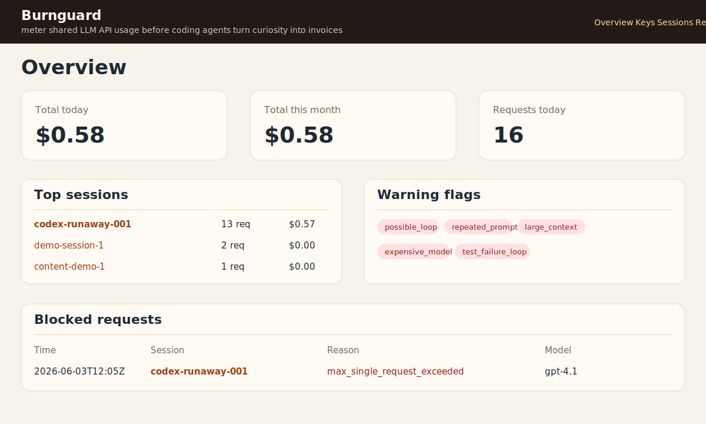

# Burnguard

**Guardrails for shared LLM API usage.**

Burnguard is a small open-source prototype for metering shared AI API usage before coding agents turn curiosity into invoices.

**GitHub description:** Guardrails for shared LLM API usage before coding agents turn curiosity into invoices.

It sits between AI tools and model providers, issuing local virtual keys, enforcing simple budgets, logging session-level usage, and flagging patterns like repeated prompts, large context, expensive model use, and possible agent loops.

> **Design-phase prototype:** Burnguard is a working MVP, not a production security product. Use mock mode first, verify model pricing before real use, and treat the dashboard as a local observability prototype.

Hopefully this category of tool is short-lived.

In a better tooling world, providers and coding agents would make per-user budgets, session-level cost visibility, and runaway-loop protection native. Until then, teams need a practical way to see who spent what, why it was spent, and when a session should have stopped.

## Why this exists

Coding agents are useful, but they can burn tokens in loops. Shared API accounts make the problem harder because a single provider key often hides which person, project, tool, or session caused the spend.

Burnguard sits between clients and an OpenAI-compatible provider:

```text
Client / Script / Coding Agent
        ↓
Burnguard Gateway
        ↓
Provider API
```

It gives teams a local MVP for visibility, simple budgets, and session-level inspection without building an enterprise platform.

## What the MVP does

- Accepts OpenAI-compatible `POST /v1/chat/completions` requests.
- Validates local virtual API keys such as `bg_sk_demo`.
- Enforces daily, monthly, and max-single-request budgets.
- Runs in **mock mode** by default so demos do not spend real API money.
- Can forward to one OpenAI-compatible provider when configured.
- Logs usage metadata to SQLite: owner, project, key, model, session, tokens, cost, status, route, latency, user-agent, category, and warning flags.
- Tracks sessions using `X-Burnguard-Session` or generates a session id automatically.
- Classifies requests with local heuristics only. No extra LLM is used.
- Detects basic risk flags: repeated prompts, possible loops, large context, expensive models, budget-near-limit, high-cost requests, and test failure loops.
- Shows a plain FastAPI/Jinja dashboard at `/`, `/keys`, `/sessions`, `/sessions/{session_id}`, and `/requests`.
- Provides `python -m token_governor seed-demo` for fake data that makes the dashboard useful immediately.

## What it does not do

This is an MVP/prototype. It does **not** provide:

- multi-user login
- SaaS billing
- Kubernetes deployment
- full enterprise RBAC
- complex frontend
- LLM-powered classification
- raw prompt storage by default
- production-grade security claims
- perfect token accounting
- perfect support for every provider
- streaming support

## Quick start

```bash
python -m venv .venv
source .venv/bin/activate
pip install -e .[dev]
cp .env.example .env
python -m token_governor seed-demo
uvicorn token_governor.main:app --reload
```

Open the dashboard:

```text
http://localhost:8000/
```

## Demo API request

Mock mode is enabled by default in `.env.example`, so this does not call a paid provider:

```bash
curl http://localhost:8000/v1/chat/completions \
  -H "Authorization: Bearer bg_sk_demo" \
  -H "Content-Type: application/json" \
  -H "X-Burnguard-Session: demo-session-1" \
  -d '{
    "model": "gpt-4o-mini",
    "messages": [
      {"role": "user", "content": "Write a Python function that adds two numbers."}
    ]
  }'
```

The gateway returns an OpenAI-compatible response and records the request.

## Create a virtual key

```bash
python -m token_governor create-key \
  --owner "Stephan" \
  --project "demo" \
  --daily-budget 5 \
  --monthly-budget 100 \
  --max-request 1
```

You can also provide `--key bg_sk_my_key` and `--allowed-models gpt-4o-mini,gpt-4.1`.

## Budget behavior

Burnguard uses HTTP **402 Payment Required** when a request is blocked by policy.

Example response:

```json
{
  "error": {
    "message": "Request blocked by Burnguard budget policy.",
    "type": "budget_exceeded",
    "details": {
      "daily_budget_usd": 5.0,
      "daily_spend_usd": 5.12
    }
  }
}
```

Budgets are intentionally simple:

- `daily_budget_usd`
- `monthly_budget_usd`
- `max_single_request_usd`

Before forwarding a request, Burnguard estimates input and expected output cost. After a provider response, it records final estimated cost from returned usage when available.

## Pricing notes

Model pricing lives in `token_governor/pricing.py`. Defaults are placeholders for demo purposes and must be verified before real use.

Included sample entries:

```json
{
  "gpt-4o-mini": {"input_per_1m": 0.15, "output_per_1m": 0.60},
  "gpt-4.1": {"input_per_1m": 2.00, "output_per_1m": 8.00},
  "claude-sonnet": {"input_per_1m": 3.00, "output_per_1m": 15.00}
}
```

## Streaming

Streaming is intentionally not supported in this MVP. Requests with `"stream": true` are rejected with HTTP 400 and an `unsupported_feature` error instead of being forwarded to the provider.

## Privacy notes

By default, Burnguard does **not** store full prompts or full responses.

It stores:

- prompt hash
- response hash
- short redacted previews capped at 200 characters
- category labels
- usage metadata

Raw message storage is controlled by:

```env
STORE_RAW_MESSAGES=false
```

If this is false, raw prompt and response bodies are not persisted. Previews are still only lightweight heuristics: common API keys, bearer tokens, passwords, secrets, and email addresses are redacted, but teams should treat previews as operational metadata rather than a security boundary.

## Configuration

Copy `.env.example` to `.env` and edit as needed:

```env
BURNGUARD_MODE=mock
DATABASE_URL=sqlite:///./burnguard.db
OPENAI_COMPATIBLE_BASE_URL=https://api.openai.com/v1
OPENAI_COMPATIBLE_API_KEY=replace_me
STORE_RAW_MESSAGES=false
DEFAULT_DAILY_BUDGET_USD=5
DEFAULT_MONTHLY_BUDGET_USD=100
DEFAULT_MAX_SINGLE_REQUEST_USD=1
LARGE_CONTEXT_TOKEN_THRESHOLD=50000
LOOP_REQUEST_COUNT=10
LOOP_WINDOW_MINUTES=15
```

To call a real OpenAI-compatible provider, set:

```env
BURNGUARD_MODE=proxy
OPENAI_COMPATIBLE_BASE_URL=https://api.openai.com/v1
OPENAI_COMPATIBLE_API_KEY=your_real_provider_key
```

## Dashboard pages

- `/` — overview: spend, requests, top users/projects/sessions/models, categories, flags, blocked requests
- `/keys` — virtual keys and budgets
- `/sessions` — session list with spend totals
- `/sessions/{session_id}` — session detail, repeated prompts, category breakdown, flags, timeline
- `/requests` — recent request log

## Exports

The dashboard includes lightweight export endpoints for offline analysis or sharing with a team. Exports never include raw prompt or response bodies; they use the same hashes, redacted previews, categories, flags, and metadata stored in SQLite.

```bash
curl http://localhost:8000/exports/requests.json
curl http://localhost:8000/exports/requests.csv
curl http://localhost:8000/exports/sessions.json
curl http://localhost:8000/exports/sessions.csv
```

You can filter exports with query parameters such as `session_id`, `owner`, `project`, `status`, `model`, and `limit`:

```bash
curl "http://localhost:8000/exports/requests.csv?session_id=codex-runaway-001&status=blocked"
```

## Screenshot

The seeded dashboard is the pitch: it shows spend, top sessions, warning flags, a fake runaway coding-agent session, and a blocked request.



## Development

```bash
pytest
python -m token_governor seed-demo
uvicorn token_governor.main:app --reload
```

## Roadmap

- OpenAI Responses API support
- Anthropic Messages API support
- LiteLLM integration
- streaming support
- Slack/Discord alerts
- GitHub PR/session correlation
- MCP/tool-call cost attribution
- repeated file/context detection
- cost-per-merged-PR reports
- per-team approval workflows
- Docker Compose deployment
- hosted dashboard mode
- richer scheduled exports and saved reports
- Prometheus/OpenTelemetry support

## LinkedIn framing

> I built a small open-source MVP called Burnguard.
>
> It is a lightweight LLM API gateway for shared API accounts. The goal is simple: show who is spending tokens, what project/session is spending them, and when a coding-agent workflow is starting to look expensive or stuck.
>
> Hopefully this kind of tool is short-lived.
>
> In a better version of the AI tooling world, every provider and coding agent would include clear per-user budgets, session-level cost visibility, and runaway-loop protection by default.
>
> But right now, a lot of teams are handing out API access and finding out later that agentic tools can burn through tokens fast.
>
> Burnguard is my prototype of the missing middle layer: virtual API keys, per-user/project budgets, session-level spend tracking, request classification, warning flags, and a simple local dashboard.
>
> It is not an enterprise product. It is a proof of concept for a problem I think more teams are about to run into.

## License

MIT
